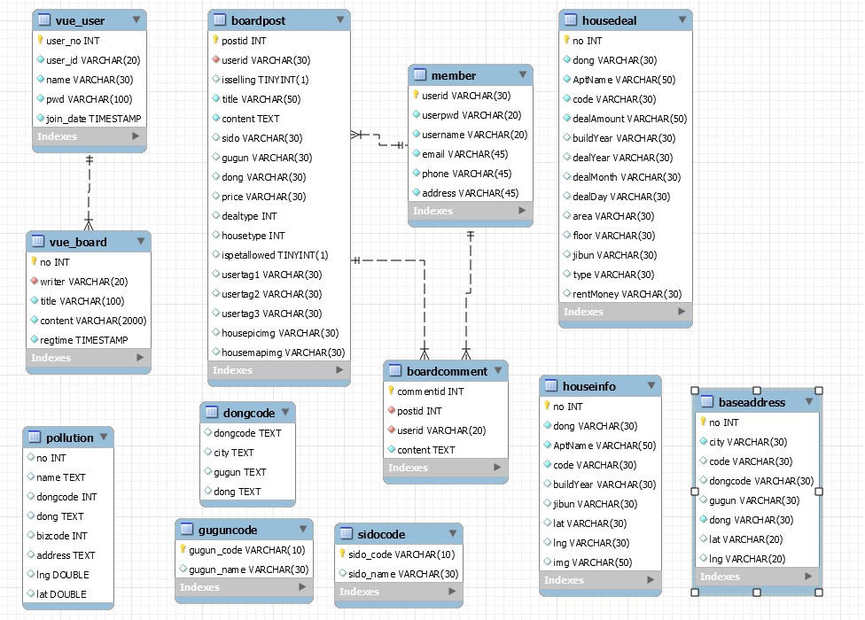
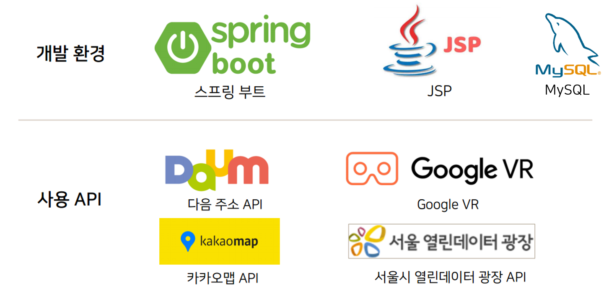

# vr-based_real_estate_sales_service
# 1. 화면 설계서
## 1-A. 메인 페이지

  
  

## 1-B. 로그인/로그아웃 및 회원정보 관리 페이지

  

## 1-C. 게시판-게시글 목록 및 등록

  
  

## 1-D. 게시판-게시글 상세내용 및 수정

  
  

# 2. 클래스 다이어 그램

  
  

# 3. Mysql DB 구조도 (ERD)

  

# 4. 요구사항 정의서 (Use Case Diagram)
## 4-A. VR 기반 Pet House Map

  

## 4-B. 게시판 (우리끼리 당근매물) 게시글 조회

  

## 4-C. 게시판-게시글 등록

  

## 4-D. 기본 회원관리 

  

# 5. 개발환경 및 API 출처

  

# 6. 시현영상
- https://www.youtube.com/watch?v=Qz_8hPhQWnk
