# vr-based_real_estate_sales_service
# 1. 화면 설계서
## 1-A. 메인 페이지
<div>
  
  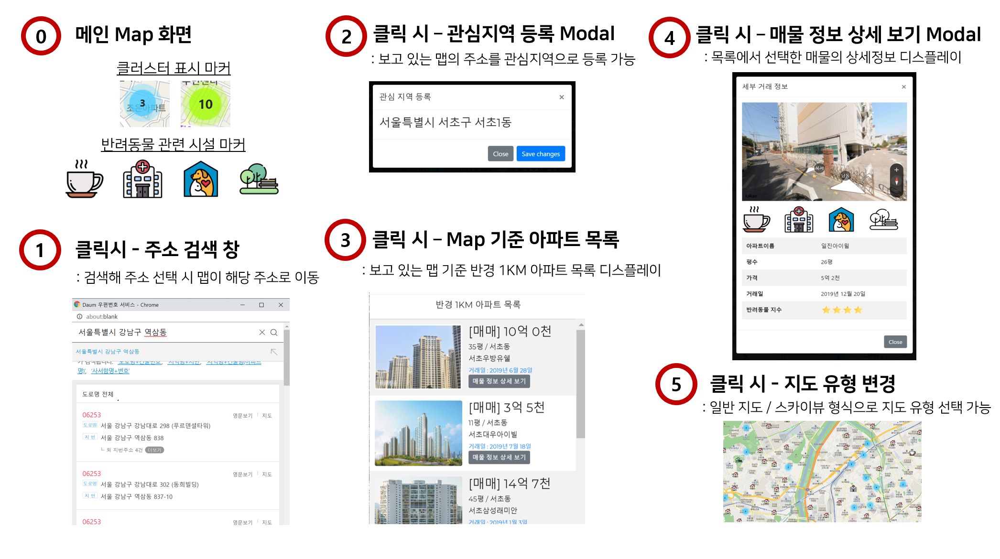
</div>

## 1-B. 로그인/로그아웃 및 회원정보 관리 페이지
<div>
  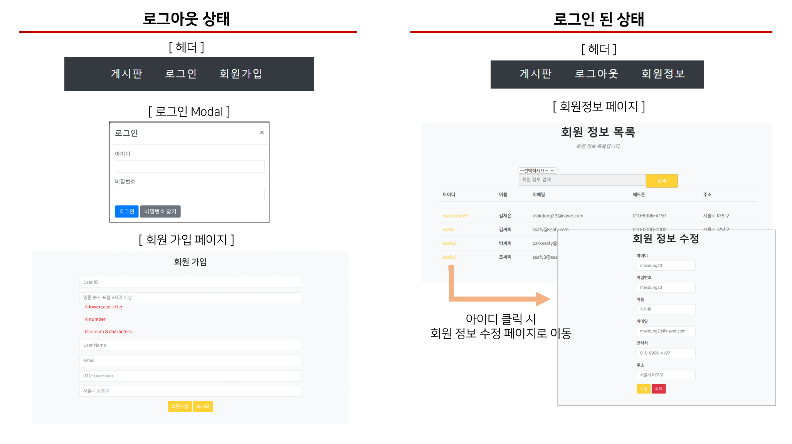
</div>

## 1-C. 게시판-게시글 목록 및 등록
<div>
  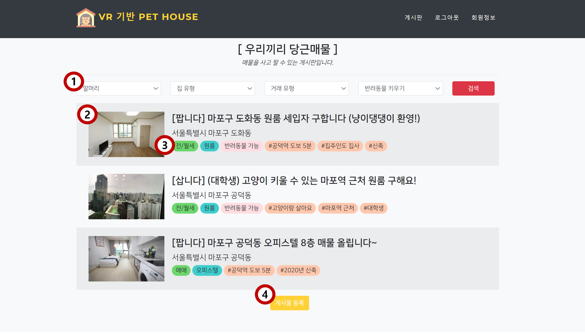
  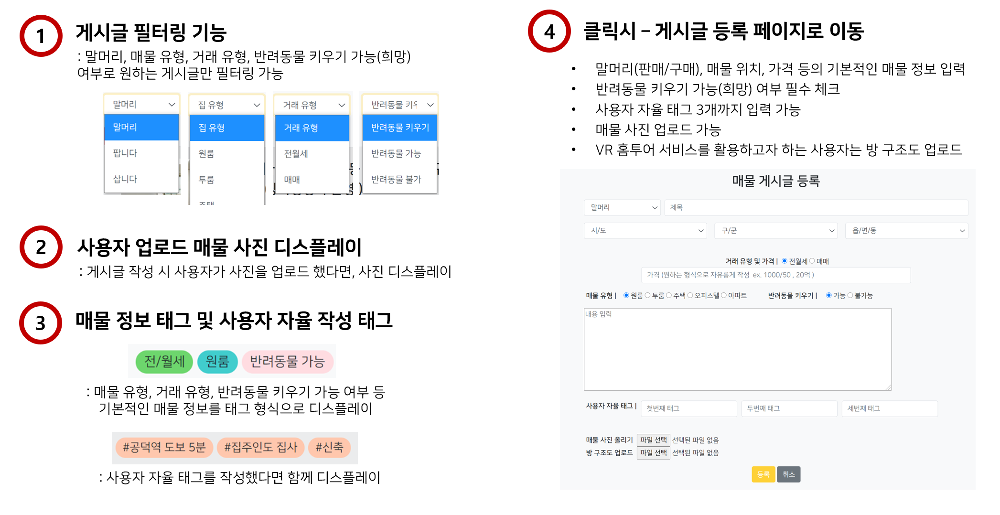
</div>

## 1-D. 게시판-게시글 상세내용 및 수정
<div>
  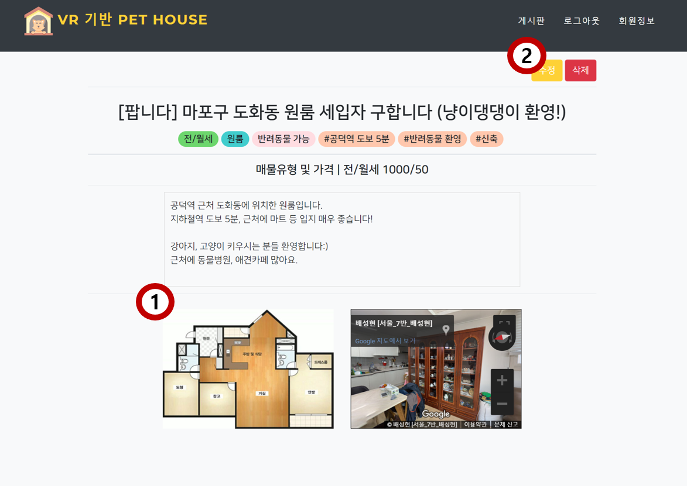
  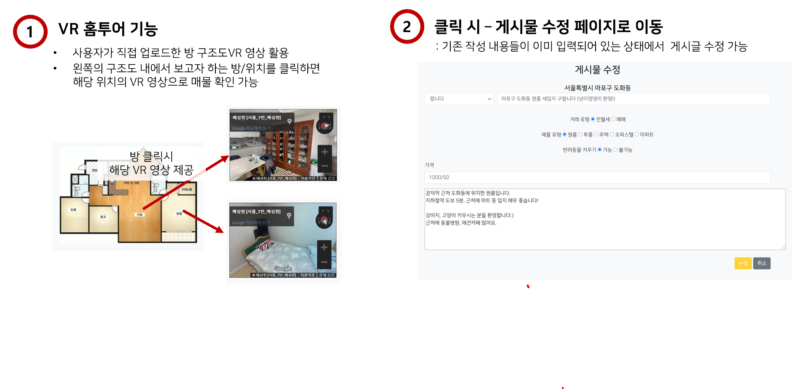
</div>

# 2. 클래스 다이어 그램
<div>
  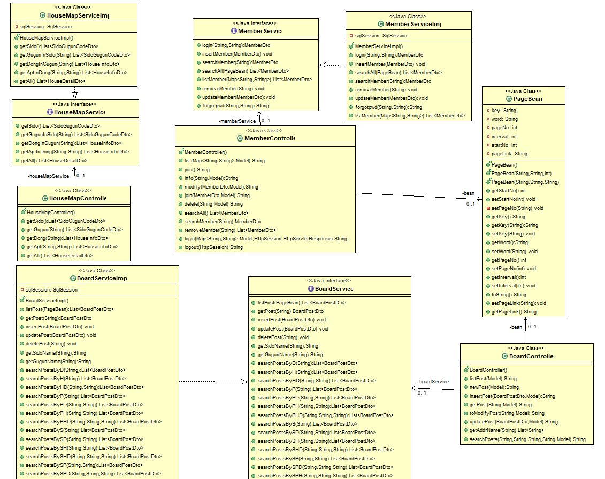
  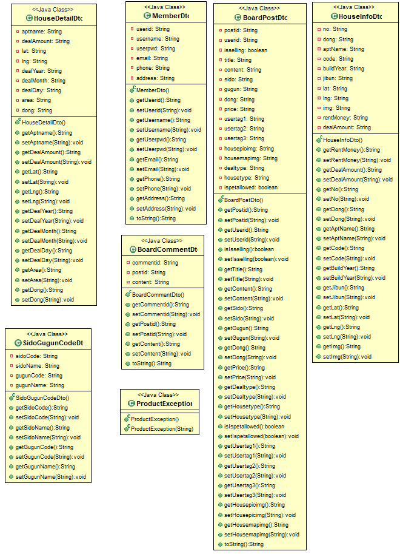
</div>

# 3. Mysql DB 구조도 (ERD)
<div>
  
</div>

# 4. 요구사항 정의서 (Use Case Diagram)
# 4-A. VR 기반 Pet House Map
<div>
  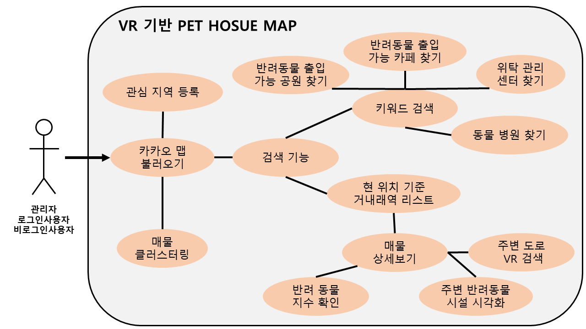
</div>

# 4-B. 게시판 (우리끼리 당근매물) 게시글 조회
<div>
  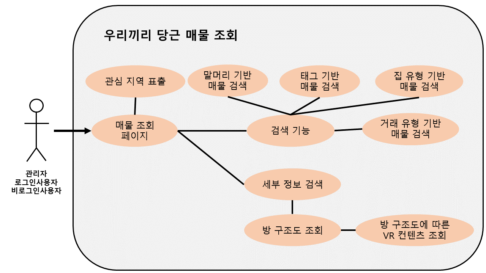
</div>

# 4-C. 게시판-게시글 등록
<div>
  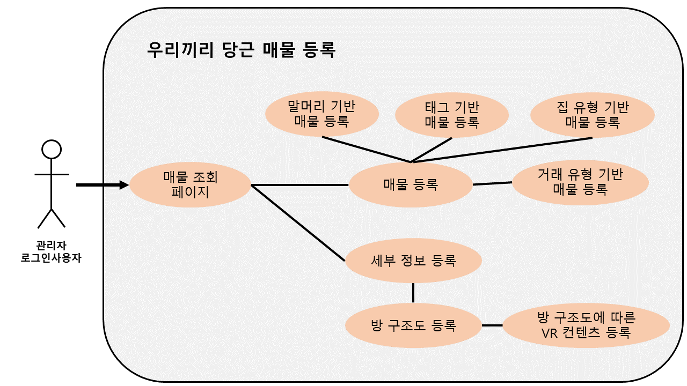
</div>

# 4-D. 기본 회원관리 
<div>
  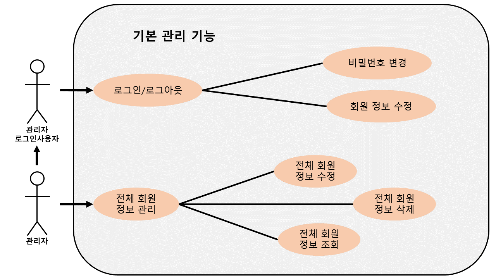
</div>


# Function

1. In Device, Taking Pictrue in realtime video
2. In Device, Control Circular LED brightness
3. In Software, Classfication of Tongue Disease (using tongue state : red tongue/white tongue/pink tongue/little coated/white coated/yellow coated/Existence of tooth scar -> Disease Diagnosis)
4. In Software, Divide and Analysis Tongue part (Divide Tongue into Top/Bottom/Side/Center part and Divide coated part or not)

# HW Device(Arduino + RaspberryPI)
<div>
  
</div>

# Presentation

<div>
  
  
  
  
</div> 


# Result Video Clip

<div>
  <p> - Device Video Clip</p>
  
  
  <p> - Website Video Clip</p>
  
</div>


## pip install

```python 3.5
(option) conda activate
pip3 install numpy
pip3 install cv2
pip3 install tesnorflow
pip3 install scipy
pip3 install scikit-learn
pip3 install keras
pip3 install matplotlib
pip3 install PIL

```
